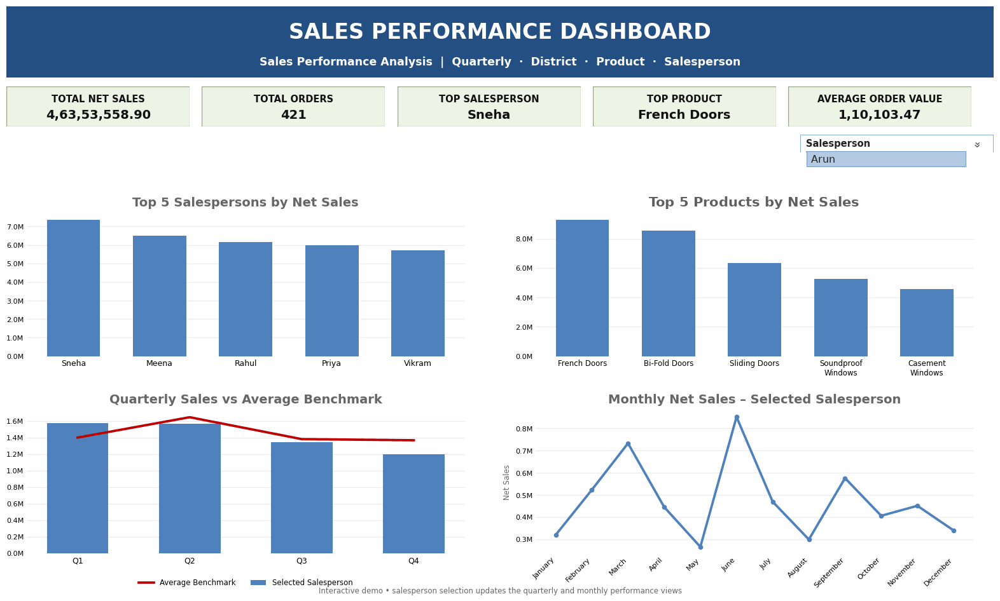

# 📊 Excel Sales Performance Dashboard

## 📌 Project Overview

This project presents an interactive Excel dashboard designed to analyze sales performance and provide actionable business insights.

The dashboard evaluates overall sales, net sales, product performance, district performance, monthly trends, and key performance indicators (KPIs).

## 🎯 Business Objective

The objective of this project is to transform raw sales data into an interactive management dashboard that helps identify:

- Overall sales performance
- Net sales trends
- Top and underperforming products
- District-wise performance
- Monthly sales trends
- Key performance indicators
- Areas requiring business attention

## 📂 Dataset

The dataset contains sales transaction data along with product, employee, district, and target-related information.

The analysis was performed using Microsoft Excel.

## 🛠️ Tools & Techniques

- Microsoft Excel
- Data Cleaning
- VLOOKUP
- XLOOKUP
- HLOOKUP
- SUMPRODUCT
- Pivot Tables
- Conditional Formatting
- Charts
- KPI Analysis
- Interactive Dashboard

## 📈 Dashboard Analysis

### Key Areas Covered

**Sales Performance**
- Total Sales
- Net Sales
- Sales trends

**Product Performance**
- Product-wise sales
- Top-performing products
- Underperforming products

**District Performance**
- District-wise sales
- Performance comparison across districts

**Monthly Analysis**
- Monthly sales trends
- Performance variations over time

**KPI Analysis**
- Key business performance indicators
- Target vs actual performance

## 💡 Key Business Insights

The dashboard enables management to quickly identify sales trends, high-performing products and districts, performance gaps, and areas requiring improvement.

It converts detailed transaction-level data into a simple and interactive visual report for business decision-making.

## 📊 Dashboard Preview

Here is a preview of the interactive Excel Sales Performance Dashboard:

📁 **[Download the Excel Dashboard](Excel%20Dashboard%20File.xlsx)**

📁 **Excel Dashboard File.xlsx**

## 🚀 Skills Demonstrated

- Data Cleaning & Preparation
- Data Analysis
- Excel Advanced Functions
- Pivot Table Analysis
- Dashboard Development
- KPI Reporting
- Business Intelligence
- Data Visualization
- Business Problem Solving

## 👩‍💻 About Me

I am an aspiring Data Analyst with experience in customer support, reporting, and business operations. I am developing my expertise in Excel, SQL, data visualization, and business analytics.

---

⭐ If you find this project useful, feel free to explore the repository.

⭐ If you find this project useful, feel free to explore the repository.
